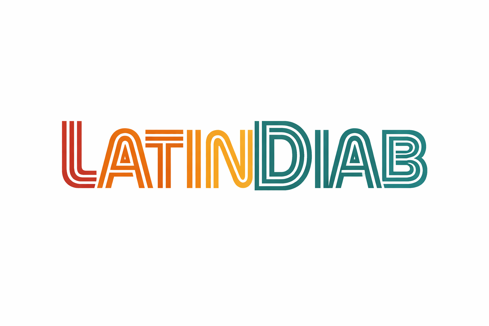

The LatinDiab project aims to implement diabetes registers in the Latin America region using a set of open source software packages. 

The project backbone are open science and reproducibility frameworks. 

Research capacity building and implementation science are the main drivers for a successful local implementation.
