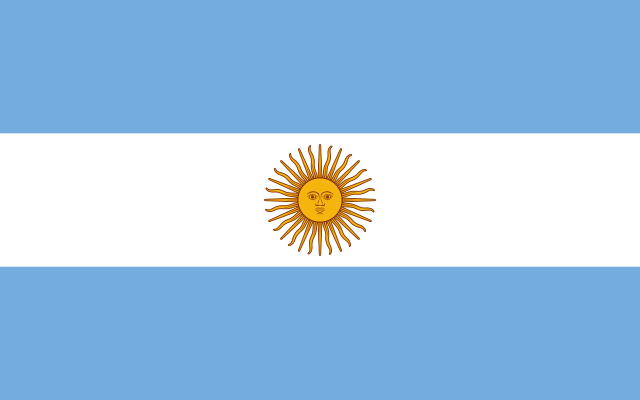
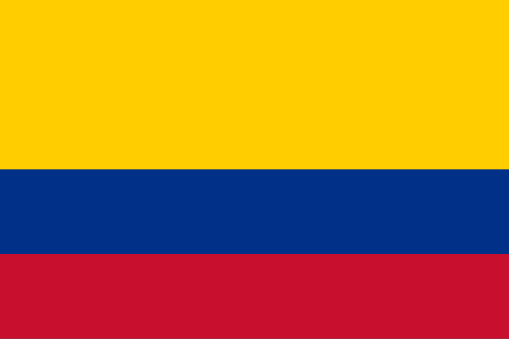
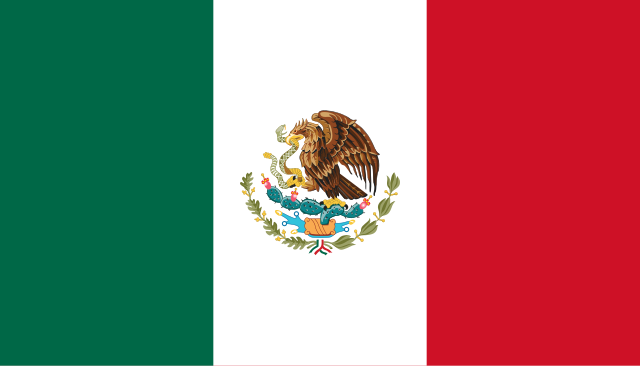
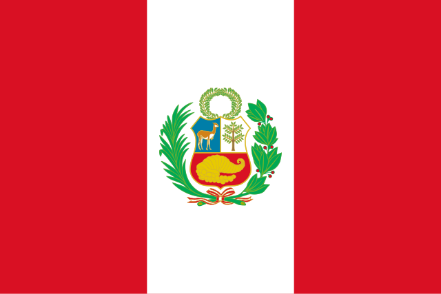
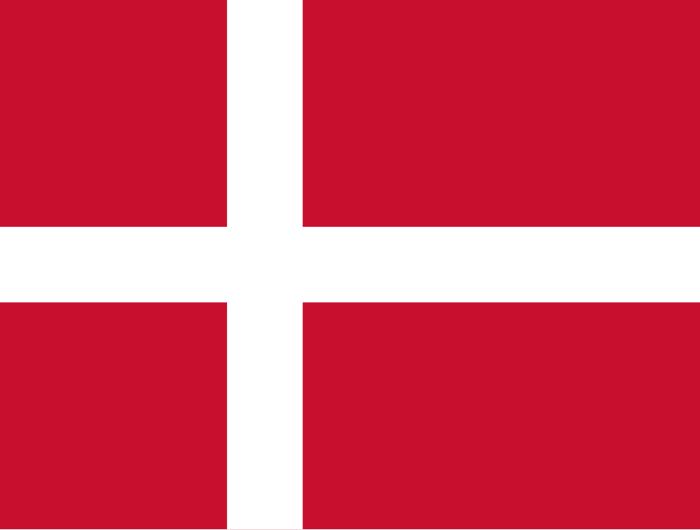
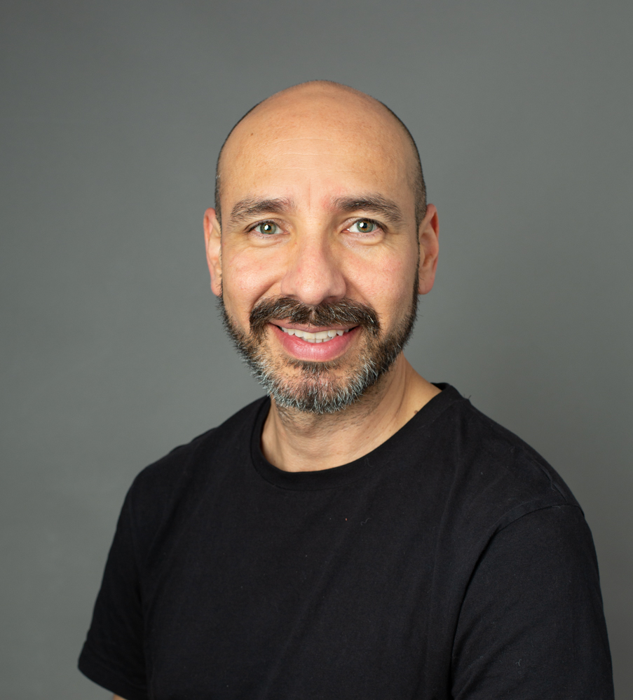
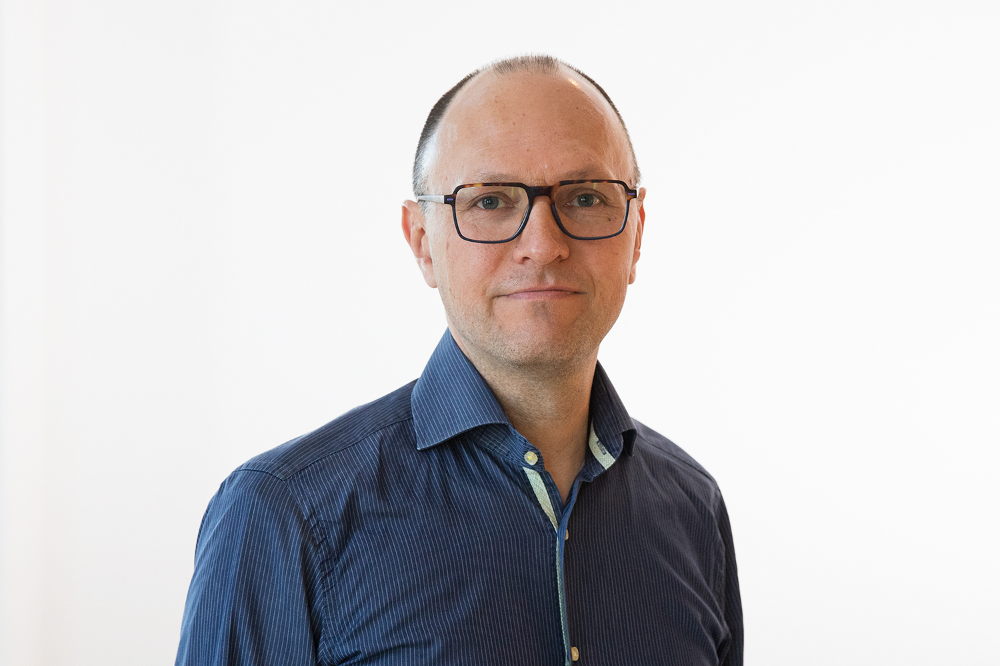

The LatinDiab project is a collaboration between diabetologists, public health specialists, and epidemiologists from Argentina, Colombia, Mexico, Peru and Denmark.

::::::::: column-body-outset
{.profile-picture 
fig-alt="Bandera de Argentina."}

::: {layout-ncol="2"}
{.profile-picture fig-alt="Paula V. Gómez."}

Paula V. Gómez is physician with a Master's degree in diabetes and specializations in nutrition and family medicine. She currently works in the research department of the Ministry of Health of La Pampa and coordinates the Integrated Diabetes Practice Unit (UPID) at the Evita Hospital in the province of La Pampa, Argentina.
:::

{.profile-picture fig-alt="Bandera de Colombia."}

::: {layout-ncol="2"}
{.profile-picture fig-alt="Paula Díaz profile picture."}

Paula Díaz is an Associate Professor at the National School of Public Health at the University of Antioquia, Colombia, and the current president of the Americas Network for Chronic Disease Surveillance.
:::

{.profile-picture fig-alt="Bandera de México."} 

::: {layout-ncol="2"}
<!--{.profile-picture fig-alt="Karla Moreno Tamayo."}-->

Karla Moreno
:::

{.profile-picture fig-alt="Bandera de Perú."}

::: {layout-ncol="2"}
<!--{.profile-picture fig-alt="María Lazo."}-->

María Lazo
:::

{.profile-picture fig-alt="Bandera de Dinamarca."}

::: {layout-ncol="2"}
{.profile-picture fig-alt="Omar Silverman profile picture."}

Omar Silverman is researcher and Assistant Professor at Aarhus University and the Steno Diabetes Center Aarhus, Denmark.

Daniel Witte is Professor of Diabetes Epidemiology at Aarhus University and at the Steno Diabetes Center Aarhus, Denmark.

{.profile-picture fig-alt="Daniel Witte profile picture."}
:::

:::::::::
