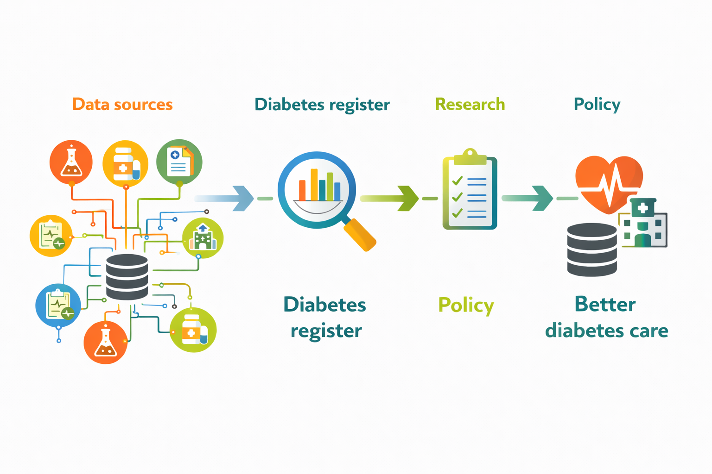

LatinDiab is a collaborative project that aims to setup modern, scalable, and efficient diabetes registers in Latin America by implementing a well documented set of open-source tools that ensure high quality, reproducible, and transparent research, leading to increase the scientific impact of these resources, improve diabetes care planning and policy making.

The LatinDiab project aims to co-design, implement, and evaluate an open-source software that will be integrated into existing health information systems for the setup of diabetes registers in Mexico, Argentina, and Colombia.

Specifically, it aims to:

-   Map the available data infrastructure from a data life cycle perspective: planning, generation, collection, processing, storing, management, access, content, permissions, maintenance; map the overall data flows and potential linkage.

-   Identify the main barriers and facilitators for a successful implementation of the open source software

-   Identify and engage key staff involved at any point of the data life cycle to co-design context specific implementation strategies of the open-source software.

-   Deploy, adapt, and integrate into current health information systems an open-source software to build a diabetes register.

-   Build research capacity in open science practices and reproducible workflows through online and onsite training sessions.

-   Co-develop the road map for scaling-up the implementation of the open-source software and the potential implementation of a federated meta-analysis.

Ultimately, the LatinDiab project will provide a proof of concept regarding how continuously updated and automated health data could be linked in order to establish a disease register. Thus, the scope of the open-source software could be transferable to other non-communicable chronic diseases.
