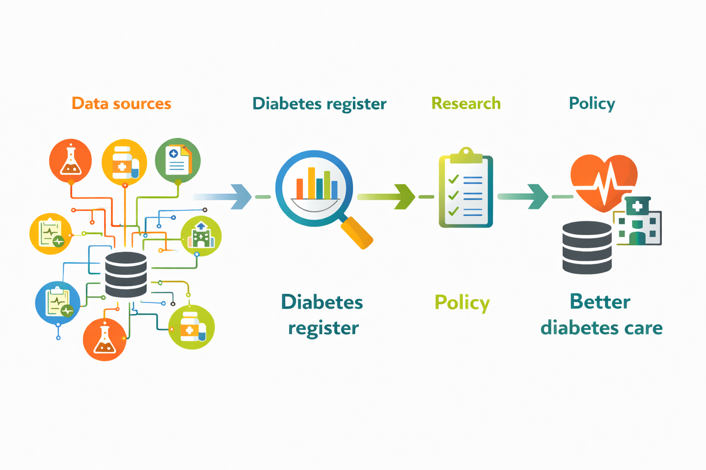

::: {style="text-align: left;"}
LatinDiab is a collaborative project that aims to setup modern, scalable, and efficient diabetes registers in Latin America by implementing a well documented set of open-source tools that ensure high quality, reproducible, and transparent research, leading to increase the scientific impact of these resources, improve diabetes care planning and policy making.

<!--insert here background information about diabetes burden, and the potential
of diabetes registers-->

Ultimately, the LatinDiab project will provide a proof of concept regarding how continuously updated and automated health data could be linked in order to establish a disease register. Thus, the scope of the open-source software tools could be transferable to other chronic cardio-metabolic diseases.

:::
