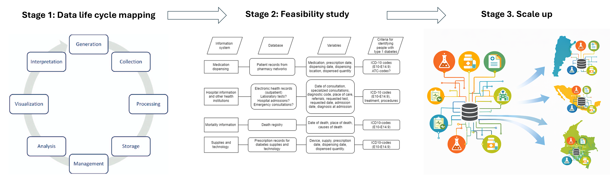

The LatinDiab project is conceptualized as a multi-country, mixed-methods implementation research project over the course of four years. The project will be implemented in three stages across Argentina, Mexico, and Colombia.

## Stage 1: Data life cycle mapping

The purpose of this stage is to map the available data sources, and identify how the generated data flows in the local health data systems. At this stage it is important to identify potential barriers and enablers for the implementation of the diabetes registers, and key players involved at each step of the data life cycle.

## Stage 2: Feasibility study and diabetes algorithm validation

Once we map the local health data life cycle, we will test the deployment of the open-source software in a relative small scale, and the integration in the current local health information systems. We will validate the diabetes register by conducting a pilot study before scaling up the implementation of the software.

## Stage 3: Scale up of the diabetes register

Once we have tested the feasibility of the implementation and evaluated the algorithm for identification of people living with diabetes, we will scale up the implementation of the diabetes register.

