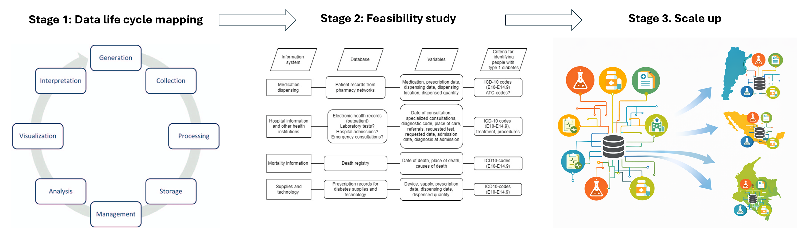

The LatinDiab project aims to co-design, implement, and evaluate open-source software tools that will be integrated into existing health data information systems for the setup of diabetes registers in Mexico, Argentina, and Colombia. 

The LatinDiab project is conceptualized as a multi-country, mixed-methods implementation research project over the course of four years. The project is planned in three stages across Argentina, Mexico, and Colombia.

## Stage 1: Data life cycle mapping

The purpose of this stage is to map the available data sources, and identify how the generated data flows in the local health data systems. At this stage it is important to identify potential barriers and enablers for the implementation of the diabetes registers, and key players involved at each step of the data life cycle.

Specifically, it aims to:

-   Map the available data infrastructure, the data flows and the potential data linkage using the data life cycle framework.

-   Identify the main barriers and facilitators for a successful implementation of the open source software tool, as well as the available undercurrent components that lay the foundation and cut across multiple data lifecycle stages: security, legal basis, architecture, orchestation, etc.

-   Identify and engage key staff involved at the different stages of the data life cycle to co-design context specific implementation strategies of the open-source software tool.

-   Assess the frequency of updating the data

## Stage 2: Feasibility study and diabetes algorithm validation

Once we map the local health data life cycle, we aim to test the deployment and integration of the open-source software tool into the current local health data information systems at a relative small scale (i.e. at the province level in Argentina, and Colombia, and at the state level in Mexico).

Research capacity building in open science practices and reproducible workflows are fundamental components for the successful implementation of the project, and standardize local teams to integrate high quality documentation and collaborative practices.

Once the diabetes register is build, the LatinDiab team will estimate the disease burden: prevalence, and incidence of type 1 and type 2 diabetes; calculate the mortality rate of type 1 and type 2 diabetes. We will be able to estimate the burden of type 1 and type 2 diabetes complications.

Co-design of the road for the implementation of a federated meta-analysis.

-   To validate the diabetes register by conducting a pilot study before scaling up the implementation of the software.

Implementation science research outcomes - adoption of the register: number of data request, number of register protocols, published pre-prints, papers, stakeholder inquiry for register output (e.g.basic demographic information of early onset t2d, number of deaths over the last 5 years) - usefulness: - fidelity: quality of documentation practices

## Stage 3: Scale up of the diabetes register

Once we have tested the feasibility of the implementation and evaluated the algorithm for identification of people living with diabetes, we will co-develop the road map for scaling-up the implementation of the open-source software tool
