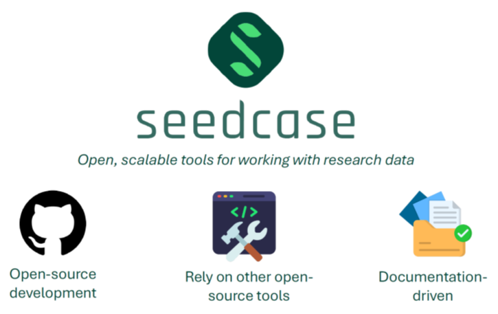

The overall project management will be done from Denmark to coordinate the collaboration between countries and to ensure the transfer of technical skills for the implementation of the open-source software, and the implementation of a high-quality technical documentation of the project following open science and reproducibility principles.

The LatinDiab project will implement the Seedcase project, an open-source data infrastructure tool that is compliant with the FAIR principles (Findable, Accessible, Interoperable, Reusable). It is designed to support modern, scalable, and efficient approaches to health information systems. By using state-of-the-art software engineering practices, Seedcase project ensures that health data are FAIR, meeting a robust stewardship, open and reproducible science. This will enable the integration of high quality, standardized registry data from Argentina, Mexico and Colombia into a shared framework.

Usage of this software tool depends on the quality of its documentation and training material, therefore there will be a local tech lead that will be responsible to liaise between Denmark and local data and research practices. Two key elements are the research operations that will simplify, streamline, and automate the collaborations and coordination of activities and products; and the technical and research capacity building that will provide the learning environment of the required technical skills in the use of modern data engineering tools through formal and informal training sessions, creating and running short workshops, and tutorials that will teach the LatinDiab project members how they can use this software tools, and local data engineers on how to implement it.

[Read more about the Seedcase project here](https://seedcase-project.org/)
