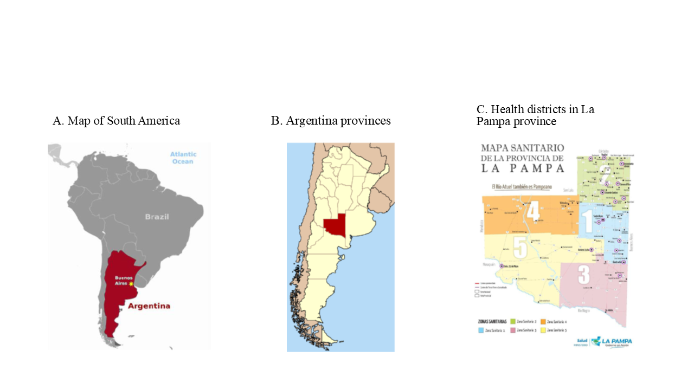

Argentina has a population of around 45 million people living in 23 provinces and the autonomous city of Buenos Aires. The province of La Pampa has 361,859 inhabitants living in an area of 143,440 km² (REF: 2022 Census). The public health system in the province of La Pampa consists of 126 healthcare facilities located across 80 localities, with about 11,000 authorized users, including health professionals and administrative staff. This health care network is administratively organized into five health zones.

The Health Information System (SIS, from its acronym in Spanish) provides an online appointment system and a central appointment desk for referral to secondary and tertiary levels of care. This information system is crucial for data access and evaluating the impact of health policies. However, the full capacity of the SIS for the diabetes programme management and decision making has not been exploited yet.
